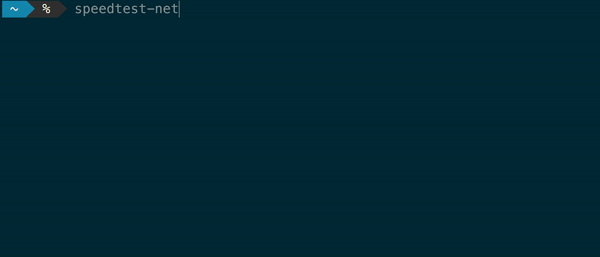

# speedtest.net API / CLI tool



## Installation

```bash
npm install --save speedtest-net
```

## Command-Line Tool
```bash
$ npm install --global speedtest-net
$ speedtest-net
```
## Usage

The whole speed test runs automatically, but a lot of events are available
to get more info than you need.

The test comes in two versions. The main one is for use by code, and then
there's a command line utility.


Code use example:
```js
const speedTest = require('speedtest-net');

(async () => {
  try {
    console.log(await speedTest());
  } catch (err) {
    console.log(err.message);
  } finally {
    process.exit(0);
  }
})();

```

## CLI options
Usage: `speedtest-net [-h|--help] [--accept-license] [--server-id <id>] [--source-ip <ip>]`

- **`-h`**, **`--help`**: Help
- **`--accept-license`**: Accept the Ookla EULA, TOS and Privacy policy. The terms only need to be accepted once.
- **`--accept-gdpr`**: Accept the Ookla GDPR terms. The terms only need to be accepted once.
- **`--server-id <id>`**: Test using a specific server by Ookla server ID
- **`--source-ip <ip>`**: Test a specific network interface identified by local IP

## Module use options

You can pass an optional `options` object.

The options include:

  - **`serverId`**: _`string`_ ID of the server to restrict the tests against.
  - **`sourceIp`**: _`string`_ IP of the network interface to bind
  - **`progress`**: _`function`_ Function to handle progress events
  - **`binary`**: _`string`_ Binary executable path of the Ookla speedtest CLI
  - **`binaryVersion`**: _`string`_ *Default `'1.0.0'`* Binary executable version
  - **`host`**: _`string`_ Server host to connect to
  - **`verbosity`**: _`number`_ Log level for `{ type: log }` progress events
  - **`acceptLicense`**: _`boolean`_ Set to `true` to accept the Ookla EULA, TOS and Privacy policy. This must be done (at least) once on the system. If you have not accepted the Ookla license terms, you can view the links to their agreements by running the speedtest-net CLI without the `--accept-license` option.
  - **`acceptGdpr`**: _`boolean`_ Set to `true` to accept the Ookla GDPR terms. This must be done (at least) once on the system. If you have not accepted the Ookla GDPR terms you can read their disclaimer by running the speedtest-net CLI without the `--accept-license` option.
  - **`cancel`**: _`function`_ A cancellation function created with `speedTest.makeCancel()` to cancel the test (See [Canceling Tests](#canceling-tests)).

## Progress Events

Each progress event has a `type` property which will be one of:

- `'config'`
- `'log'`
- `'testStart'`
- `'ping'`
- `'download'`
- `'upload'`

Each event contains a `progress` property at the root which indicates the overall progress of the test as a fraction (0 to 1).

The `ping`, `download` and `upload` events also contain a `progress` property inside the content data object (with the same name as the event name) which indicates the progress of the current test.

All events except `config` contain a `timestamp` property which will be a `Date` object.

### Config event
This event **is only sent** when the `verbosity` is 2 or greater. It contains a bunch of information about the test:

```js
{
  type: 'config',
  progress: 0,
  suite: {
    global: {
      engine: {
        threadCount: 4,
        testDurationSeconds: 15,
        packetSizeBytes: 32000000,
        isUploadFirst: false
      },
      dynamic: {
        stableStop: { isEnabled: true },
        download: { isScalingEnabled: true, maxThreadCount: 32 }
      }
    },
    testStage: {
      latency: { pingCount: 5 },
      upload: {
        isServerUploadEnabled: true,
        isClientPrimaryMeasureMethod: false
      }
    }
  },
  app: {
    traceLevel: 2,
    ispName: 'Slower Web Inc',
    licenseKey: '408003aeea741916-C93ad77cb653213a5-a3d0efbb2e3723d4',
    saveTestResultUrl: 'https://results.speedtest.net/reports',
    resultFormat: 'json',
    license: {
      message: 'You may only use this Speedtest software and information generated\nfrom it for personal, non-commercial use, through a command line\ninterface on a personal computer. Your use of this software is subject\nto the End User License Agreement, Terms of Use and Privacy Policy at\nthese URLs:\n\n\thttps://www.speedtest.net/about/eula\n\thttps://www.speedtest.net/about/terms\n\thttps://www.speedtest.net/about/privacy',
      version: 'a754f1d8862e34fda3a580af273344e3b7b892fb5a8eb755f1f639aaf8b30bdf'
    }
  },
  servers: [
    {
      id: '1234',
      host_functional: '1',
      host: 'speedtest.someserver.net:8080',
      name: 'Awesome test server',
      country: 'United States',
      sponsor: 'United people of the world'
    },
    {
      id: '1235',
      host_functional: '1',
      host: 'supertestserver.net:8080',
      name: 'Cruddy test server',
      country: 'United States',
      sponsor: 'Some company'
    }
  ]
}
```

### Log event

These are various log messages. Only sent when `verbosity` is 1 or greater. Higher verbosity leads to more messages. That's all I know.

Each log is associated with a log level. Levels include `info` and `warning` and may include others.

```js
{
  type: 'log',
  progress: 0.7391304347826086,
  timestamp: [Date],
  message: 'Starting stage 3 of type 4',
  level: 'info'
}
```

### Test start Event

This contains information about the test to be run.

```js
{
  type: 'testStart',
  progress: 0,
  timestamp: [Date],
  isp: 'Slower Web Inc',
  interface: {
    internalIp: '10.1.1.10',
    name: '',
    macAddr: '00:FE:C1:12:4A:ZX',
    isVpn: false,
    externalIp: '104.1.1.17'
  },
  server: {
    id: 1234,
    host_functional: '1',
    name: 'Awesome test server',
    location: 'New York, NY',
    country: 'United States',
    host: 'speedtest.someserver.net:8080',
    port: 8080,
    ip: '192.1.1.3'
  }
}
```

### Ping event
Sent when the test is in the ping phase. Jitter and latency are in milliseconds.

```js
{
  type: 'ping',
  progress: 0.034782608695652174,
  timestamp: [Date],
  ping: { jitter: 1.297, latency: 12.363, progress: 0.4 }
}
```

### Download event
Sent when the test is in the download phase. Bandwidth is in bytes per second.

```js
{
      type: 'download',
      progress: 0.205523,
      timestamp: [Date],
      download: {
        bandwidth: 116904636,
        bytes: 334816510,
        elapsed: 2727,
        progress: 0.18180193333333333
      }
    }
```

### Upload event
Sent when the test is in the upload phase. Bandwidth is in bytes per second.

```js
{
  type: 'upload',
  progress: 0.8351304347826086,
  timestamp: [Date],
  upload: {
    bandwidth: 3625125,
    bytes: 19799551,
    elapsed: 5520,
    progress: 0.368
  }
}
```

## Return value
The `speedTest` function returns a promise that resolves to an object with the following shape:

```js
{
  timestamp: [Date],
  ping: { jitter: 1.022, latency: 12.363 },
  download: { bandwidth: 87757724, bytes: 959666451, elapsed: 10804 },
  upload: { bandwidth: 3701179, bytes: 35468808, elapsed: 9703 },
  packetLoss: 8.837209302325581,
  isp: 'Slower Web Inc',
  interface: {
    internalIp: '10.1.1.10',
    name: '',
    macAddr: '00:FE:C1:12:4A:ZX',
    isVpn: false,
    externalIp: '104.1.1.17'
  },
  server: {
    id: 1234,
    host_functional: '1',
    name: 'Awesome test server',
    location: 'New York, NY',
    country: 'United States',
    host: 'speedtest.someserver.net:8080',
    port: 8080,
    ip: '192.1.1.3'
  },
  result: {
    id: 'd5ac8c40-3d69-39ac-cfc1-3b349df780e9',
    url: 'https://www.speedtest.net/result/c/d5ac8c40-3d69-39ac-cfc1-3b349df780e9'
  }
}
```

## Canceling Tests

You can cancel tests by creating a test canceler with `makeCancel()`. Then pass this canceler to the test. Now, when the canceler is called, the test will be terminated. The promise will reject with an error.

If the canceler is called before the test is started, the test will abort before starting.

Canceler functions are not meant to be reused.

```js
const speedTest = require('speedtest-net');

(async () => {
  try {
    const cancel = speedTest.makeCancel();
    setTimeout(cancel, 1000);
    console.log(await speedTest({ cancel }));
  } catch (err) {
    console.log(err.message);
  } finally {
    process.exit(0);
  }
})();
```

## Considerations
This uses the official Ookla command line client so the results should be the same as the speedtest.net tests you can run in the browser.

When running the speed test for the first time you may get an error indicating you need to accept the Ookla license terms. For the CLI you can pass the `--accept-license` option. For the module, you can pass the `{ acceptLicense: true }` option. If you're located in Europe you might need to accept the additional GDPR terms, this can be done by passing `--accept-gdpr` for the CLI and the `{ acceptGdpr: true }` option when used as a module.

When running the test for the first time, and a CLI binary is not yet available, the client will be automatically downloaded from the Ookla server and unpacked. The file will then be marked as executable. This step may fail if the calling process does not have sufficient permissions. To get around this, you can pass either a custom `binary` option (module only), or manually mark the file as executable. The latter option is not recommended since this can break if you need to run `npm install` or `yarn`.

## License

[MIT](http://choosealicense.com/licenses/mit/)
